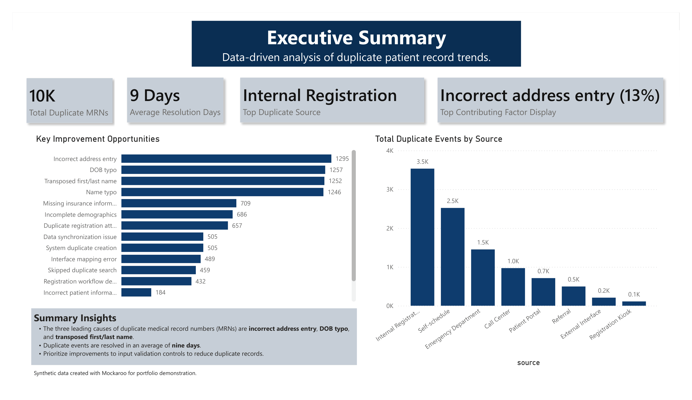
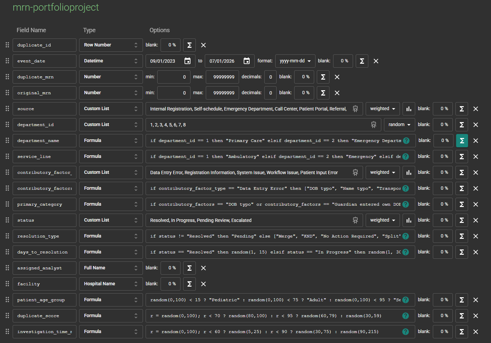
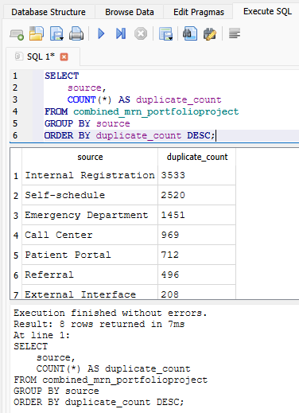
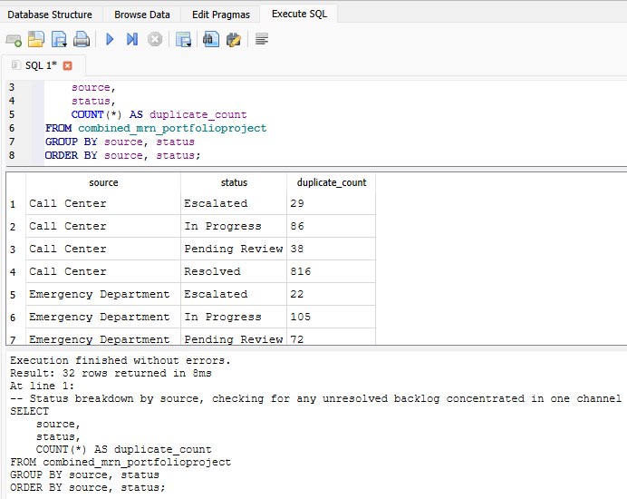
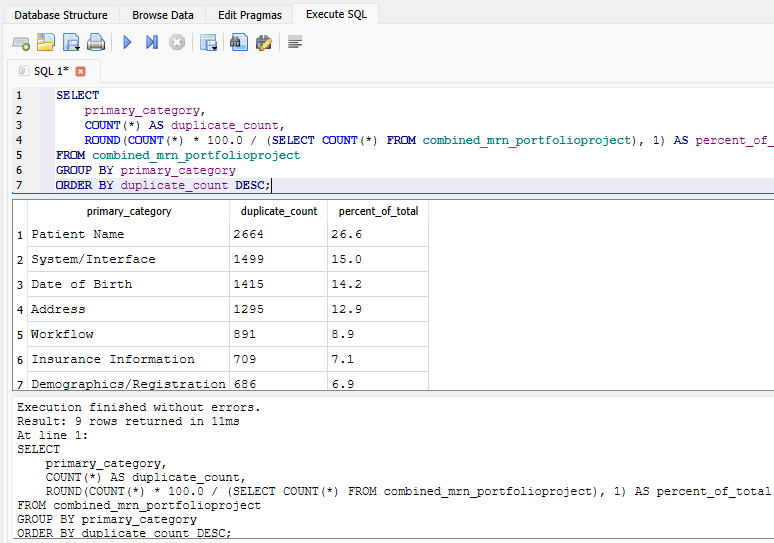
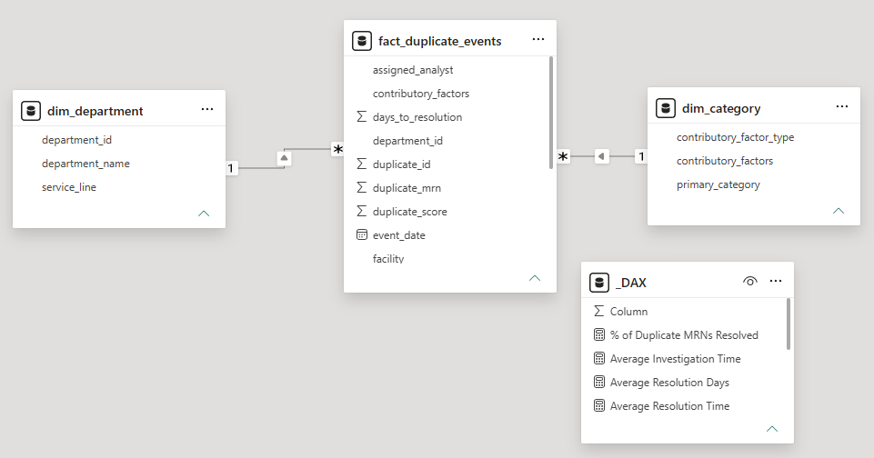
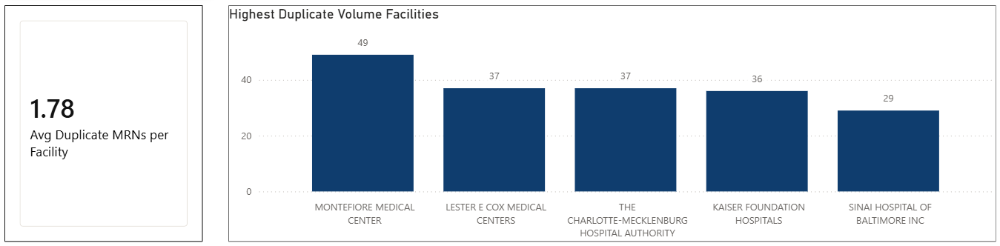

# Duplicate MRN Analysis Project




---
## Problem Description
Duplicate medical record numbers (MRNs) are a costly problem in healthcare. When the same patient ends up with multiple MRNs due to typos, mismatched demographics, or system errors, their clinical history gets fragmented across separate records. This creates real risk for care teams working from incomplete patient histories, and adds ongoing burden for Healthcare Information Management (HIM) teams who have to investigate and merge duplicates after the fact.

This E2E project simulates a duplicate MRN investigation workflow using a synthetic dataset (Mockaroo) across several medical facilities. Using SQL and Power BI, I investigate the origins of duplicates, the causes of these issues, the time it takes to resolve them, and identify the most significant opportunities to reduce them.

## Dataset Information

The dataset was synthetically generated using Mockaroo, producing 19 columns covering duplicate MRN event details, contributing factors, and resolution outcomes. Since Mockaroo's free tier caps generation at 1,000 rows per download, I generated 10 separate files of 1,000 rows each and combined them into a single CSV of 10,000 records. To keep the data realistic and consistent, I applied constraints during generation, like tying department_id values to matching department_name values across rows.



After creating the dataset, I validated it with SQLite, checking row counts, missing values, and key distributions before building the star schema in Power BI.

### Query 1: Duplicate Volume by Source

This query confirms that Internal Registration is the leading source of duplicate MRNs, consistent with what's shown on the executive summary page.



### Query 2: Status Breakdown by Source

This query checks whether any registration source has an unusual backlog of unresolved duplicates relative to the others.



### Query 3: Primary Category Breakdown

This query shows that Patient Name issues account for the largest share of duplicates at 26.6%, followed by System/Interface and Date of Birth errors.




I also created a separate _dax table to house all DAX measures, keeping calculations organized and separate from the underlying data tables. I prefixed the table name with an underscore so it sorts to the top of the Data pane- I found this to be especially helpful when creating the visuals.



## Problem Statement

A healthcare organization operating across multiple facilities is experiencing a growing volume of duplicate MRNs, but lacks visibility into the root causes, resolution efficiency, and improvement opportunities behind them. This analysis aims to answer:

- Which facilities and service lines generate the most duplicate MRNs?
- Which patient demographics are the most affected?
- What are the root causes driving duplication?
- How effectively are they being resolved (time to resolution, resolution type, investigation effort)?
- Where should process improvement efforts be prioritized to reduce future duplicates?

The deliverable is a 3-page Power BI report, built on a normalized star schema and SQL-validated dataset, that surfaces these insights for stakeholders such as HIM leadership and registration/process improvement teams.

## Design Rationale

This section walks through some of the thought process and decision-making behind key DAX measures and visuals in the report.

This visual uses a simple count of `duplicate_id` (the fact table's primary key) on the Y-axis, with `facility` on the X-axis, filtered to the Top 5. No DAX measure was needed here. Since there are over 1,000 unique facilities in the dataset, showing all of them would make the chart unreadable, so I limited it to the top 5 for clarity.



Placed directly next to the facility chart above, this card gives that visual more context. On its own, "49 duplicates at the highest facility" doesn't mean much, but paired with an average of 1 duplicate per facility, it becomes clear just how much of an outlier the top facility really is. This uses the following measure:

```dax
Avg Duplicate MRNs per Facility = 
AVERAGEX(
    VALUES(fact_duplicate_events[facility]),
    CALCULATE(COUNTROWS(fact_duplicate_events))
)
```

## Outcome

The final product is a presentation, which you can view [here](pptx/presentation.pdf). This analysis surfaced clear opportunities to reduce duplicate MRN creation and improve resolution efficiency:

- Internal Registration was the leading source of duplicate MRNs.
- Incorrect address entry, DOB typos, and transposed names were the top contributing factors, pointing to a need for stronger input validation at the point of registration rather than downstream cleanup.
- Duplicate events took an average of 9 days to resolve, indicating room to streamline the investigation and merge process.

Recommended next steps include:

- Tightening registration-time validation
- Prioritizing fixes for the top contributing factors
- Investing into automation software to avoid user errors
- Establishing specific, department-level resolution targets

## Future Enhancements

Here are some ideas I would explore if I kept building this project further:

- Create a fourth report page to analyze newly generated data that shows information about analyst performance in identifying and correcting duplicate MRNs
- Layer in an estimated cost to help prioritize which contributing factors/sources are worth fixing first, and to measure the additional expenses accured by these duplication errors

## Contact Information

You can contact me via email at [ethan-jacob@comcast.net](mailto:ethan-jacob@comcast.net) or connect with me on [LinkedIn](https://www.linkedin.com/in/ethan-dobbs).

Thank you for reviewing my Duplicate MRN Analysis Project! I hope this project gives useful insight into how I approach data analysis.
 
